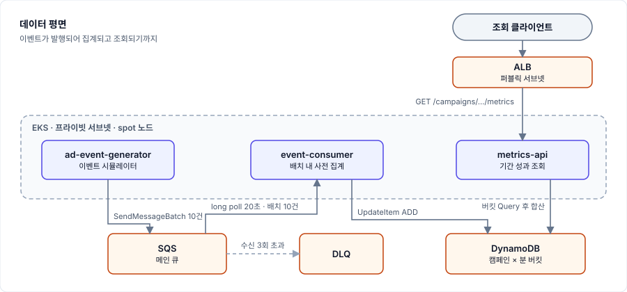
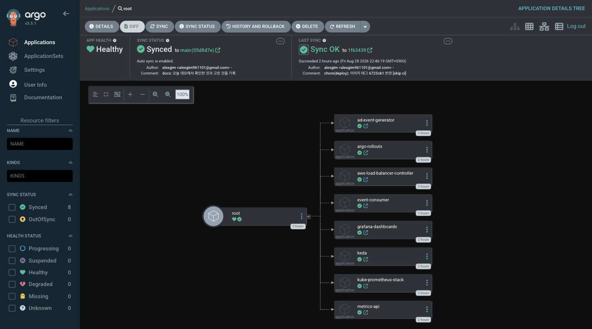
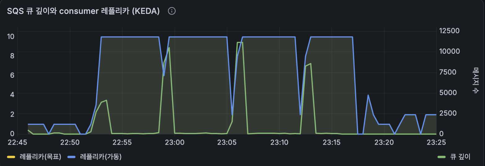
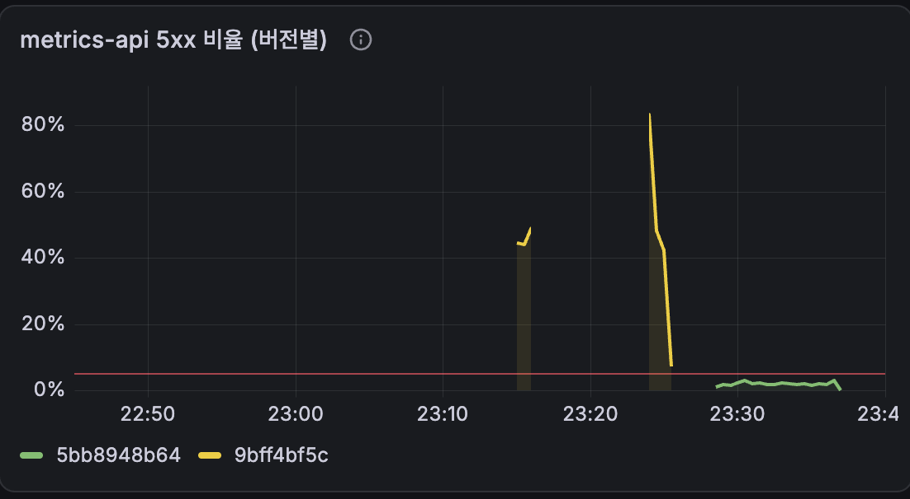
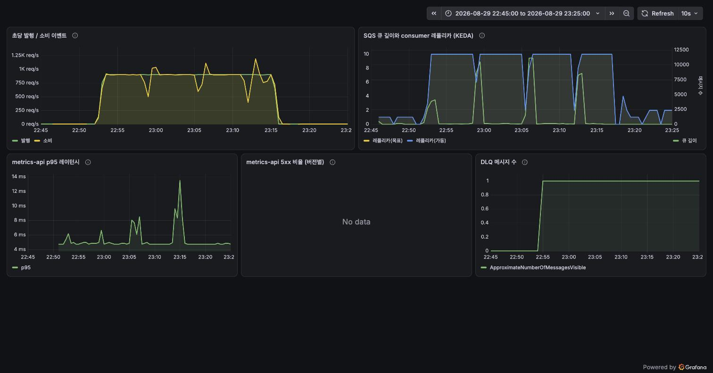

# adspectrum

[](https://github.com/alexgim961101/adspectrum/actions/workflows/ci.yaml)

광고 성과 이벤트를 실시간으로 수집·집계하는 이벤트 드리븐 파이프라인을
AWS EKS 위에 IaC(Terraform)와 GitOps(ArgoCD)로 구축·운영하는 프로젝트.

> 이름은 프리즘을 통과한 빛이 스펙트럼이 되듯,
> 파편화된 광고 이벤트 스트림을 분해·집계해 보이게 만든다는 의미입니다.

클러스터를 통째로 지웠다가 다시 만드는 것까지 포함해, 아래의 모든 수치는 실제로
돌려 보고 기록한 값입니다.

## 아키텍처



컨슈머는 **성공한 메시지만 삭제합니다.** 실패한 메시지는 그대로 두어 SQS가 재전달하고,
3회를 넘기면 점선 경로를 따라 DLQ로 빠집니다. 배포 흐름과 자동 제어 루프는
[설계 스펙 3장](docs/SPEC.md)에 따로 그려 두었습니다.

이벤트는 초당 N건 생성되어 SQS로 배치 발행되고, 컨슈머가 롱 폴링으로 받아 캠페인·분
단위로 사전 집계한 뒤 DynamoDB에 원자적 카운터로 반영합니다. 조회 API는 분 버킷을
합산해 CTR/CVR/CPC를 계산합니다. 계약과 스키마는 [docs/API.md](docs/API.md)에 있습니다.



뿌리 Application 하나가 나머지 여덟 개를 관리합니다. 사람이 손으로 넣는 것은 이 뿌리
하나뿐이고, 그 뒤로는 `deploy/apps/`에 파일을 추가하는 커밋만으로 컴포넌트가 늘어납니다.

## 무엇이 실제로 동작하는가

| # | 완료 정의 | 결과 |
|---|---|---|
| 1 | `apply` → `destroy` → 재 `apply`가 수동 개입 없이 동작 | 리소스 **74개, 11분** (2026-08-28 실측). 예산 리소스 1개가 일시적 DNS 오류로 실패해 `apply`를 한 번 더 돌렸다 |
| 2 | push 하나로 빌드·푸시·태그 갱신·배포가 이어짐 | CI가 이미지 태그 갱신 커밋을 되밀고 ArgoCD가 동기화 |
| 3 | 큐가 쌓이면 컨슈머 0→N, 비면 다시 0 | **0 → 3 → 5 → 0** 관측 |
| 4 | 결함 버전이 카나리 분석에 걸려 자동 롤백 | 20% 단계에서 **85초** 만에 중단, 가중치 자동 복구 |
| 5 | 다이어그램·캡처·의사결정 기록 | 이 문서와 [docs/DECISIONS.md](docs/DECISIONS.md) |

### 오토스케일링 (KEDA)

부하는 `kubectl`이 아니라 **커밋**으로 넣습니다. `deploy/values/`의 발행량을 바꿔 push하면
그것이 부하 주입이고, 되돌리는 것도 커밋입니다. 클러스터를 직접 만지지 않는다는 원칙을
부하 시나리오에도 그대로 적용했습니다.

| 시각 | 조치 | 관측 |
|---|---|---|
| 22:52 | 발행 5 → 300건/초 | 70초 뒤 레플리카 2 → 3 |
| 22:58 | 발행 파드 2개 (600건/초) | 40초 뒤 레플리카 **5** (상한). 큐 150~330 유지 |
| 23:03 | 발행 중단 | 55초 뒤 큐 0 → 2분 30초 뒤 레플리카 **0** |



파란 선이 컨슈머 레플리카, 초록 선이 KEDA 스케일러가 읽은 큐 길이입니다. 큐가 쌓이면
레플리카가 따라 오르고, 유입이 끊기면 0으로 내려갑니다. CloudWatch가 아니라 KEDA가
판단에 실제로 쓴 값을 그리기 때문에 그래프와 동작이 어긋나지 않습니다
([DECISIONS 014](docs/DECISIONS.md)).

컨슈머 파드 하나가 초당 약 200건을 처리합니다. 그래서 초당 300건은 파드 3개로 흡수되고
큐가 쌓이지 않습니다 — 상한까지 밀어 올리려면 소비 능력을 넘는 발행이 필요했습니다.

### 카나리 자동 롤백 (Argo Rollouts)

새 버전은 ALB 가중치로 20% → 50% → 100%로 넓히고, 각 단계에서 **카나리 파드만의**
5xx 비율을 Prometheus에 물어봅니다. 5%를 넘으면 스스로 중단하고 안정 버전 100%로
되돌립니다. 레플리카 비율이 아니라 ALB 가중치를 쓰는 이유는 레플리카 2개로는 20%를
표현할 수 없기 때문입니다.

| 배포 | 주입한 오류율 | 결과 |
|---|---|---|
| 결함 버전 | 50% | 20% 단계에서 중단 (측정값 0.51 → 0.48), 85초 |
| 기준선 아래 | 2% | 20% → 50% → 100% 승격 (측정값 0.011 ~ 0.027), 3분 30초 |

```
Status:  ✖ Degraded
Message: RolloutAborted: Rollout aborted update to revision 4:
         Step-based analysis phase error/failed:
         Metric "error-rate" assessed Failed due to failed (2) > failureLimit (1)
Step:    0/4    SetWeight: 0    ActualWeight: 0
```



빨간 선이 롤백 기준(5%)입니다. 노란 계열이 결함 버전인데, 두 번의 주입 모두 기준선을
크게 넘긴 직후 끊깁니다 — 끊긴 지점이 자동 롤백된 시각입니다. 초록 계열은 오류율 2%
버전으로, 기준선 아래라 그대로 100%까지 승격됐습니다. 계열을 나누는 라벨은 PodMonitor가
파드에서 옮겨 온 `rollouts_pod_template_hash`입니다.

**이 안전장치는 처음에 조용히 실패했습니다.** 첫 시도에서 결함 버전이 20% 관문을
통과해 50%까지 올라갔는데, 원인은 "지표가 아직 없음"을 "에러율 0%"로 계산한
쿼리 가드였습니다. 원인·수정·재검증 과정은 [DECISIONS 013](docs/DECISIONS.md)에
있습니다. 안전장치는 동작하는 것을 확인하기 전까지 동작한다고 말할 수 없습니다.

### CI가 하는 일

`apps/**` 또는 `charts/**`가 바뀐 push에서만 돌고, 변경된 앱만 골라 검사·빌드합니다.
실행 기록은 [Actions 탭](https://github.com/alexgim961101/adspectrum/actions/workflows/ci.yaml)에
전부 남아 있습니다.

```
push(main) ─▶ 변경 감지 ─▶ ruff·pytest ─▶ 이미지 푸시(ECR)
                                              │
                  deploy/values 태그 갱신 커밋 ◀┘
                             │
                             └─▶ ArgoCD가 감지해 배포
```

차트만 바뀐 push는 **18~25초**에 끝납니다. ArgoCD가 차트를 Git에서 직접 받아 가므로
이미지를 다시 구울 이유가 없고, 대신 실제 values를 얹은 `helm template`으로 렌더링
오류를 머지 전에 잡습니다. AWS 자격증명은 GitHub OIDC로 받고 신뢰 정책이
`refs/heads/main`으로 잠겨 있어, PR 실행에서는 역할을 맡는 것 자체가 불가능합니다.

자기 자신을 되부르는 고리는 세 겹으로 막았습니다 — 트리거 경로에 `deploy/**`가 없고,
갱신 커밋에 `[skip ci]`가 붙고, `GITHUB_TOKEN`으로 만든 푸시는 워크플로를 부르지
않습니다. 성격이 다른 세 방어선이라 하나를 건드려도 나머지가 남습니다.

### API 부하 (k6)

| 지표 | 값 |
|---|---|
| 요청 수 | 45,001건 (30 rps × 25분, 도착률 이탈 0) |
| p95 / 평균 | 18.18ms / 15.22ms |
| 실패율 | 1.75% — 전부 롤백 데모에서 의도적으로 주입한 500 |

## 이 프로젝트가 다루는 것

| 영역 | 프로젝트 요소 |
|---|---|
| 클라우드 인프라를 코드로 설계·운영 | Terraform 모듈로 VPC/EKS/SQS/DynamoDB/ECR/IAM 관리, destroy·재적용 멱등성 |
| GitOps·CI/CD 파이프라인 | GitHub Actions(CI) + ArgoCD app-of-apps(CD), 모노레포에서 `deploy/` 경로 격리 |
| 모니터링·옵저버빌리티 | kube-prometheus-stack, 코드로 관리하는 Grafana 대시보드, DLQ, 에러율 기반 자동 롤백 |
| 비용 최적화 | spot 노드, KEDA scale-to-zero, 단일 NAT, 온디맨드 DynamoDB, 예산 알람 |
| 보안·접근 관리 | IRSA 파드별 최소 권한, GitHub OIDC(장기 시크릿 없는 CI 인증), 읽기 전용 배포 키 |
| 이벤트 드리븐 파이프라인 | SQS + DLQ, 배치 사전 집계, KEDA 큐 길이 오토스케일링 |
| 점진적 배포 | Argo Rollouts 카나리 + Prometheus 분석 자동 롤백 |

## 설계에서 내린 선택

전체 기록은 [docs/DECISIONS.md](docs/DECISIONS.md)에 상황→선택지→결정→근거 형식으로
남아 있습니다. 굵직한 것만 옮기면 다음과 같습니다.

- **모노레포** — GitOps 정석은 앱/배포 저장소 분리지만, 1인 프로젝트에서는 링크 하나로
  전체를 파악하는 가치가 더 큽니다. 분리 원칙은 `deploy/` 경로 격리로 표현하고, CI 루프는
  경로 필터·`[skip ci]`·토큰 규칙 세 겹으로 막았습니다.
- **집계 중복 허용** — SQS는 at-least-once라 재전달 시 집계가 중복될 수 있습니다. MVP에서는
  소량의 오차를 받아들이고, `event_id` 기반 dedup은 로드맵으로 남겼습니다.
- **Terraform 상태를 S3로 옮김** — 처음에는 1인 프로젝트라 로컬 state로 시작했습니다.
  CI가 PR마다 `plan`을 돌리려면 상태를 읽어야 해서 뒤집었고, 마침 리소스가 0개인
  시점이라 이전 비용이 없었습니다. 결정을 언제 왜 뒤집었는지는 DECISIONS 015에 있습니다.
- **단일 NAT Gateway** — 가용성보다 비용을 택했습니다. 프로덕션이라면 AZ마다 둡니다.
- **VPC CNI prefix delegation** — 기본 설정에서는 `t3.medium` 한 대가 파드 17개까지만
  수용해 플랫폼 컴포넌트만으로 자리가 찼습니다. 켠 뒤 110개가 됐습니다.

## 확장 로드맵

의도적으로 범위 밖에 둔 것들입니다.

- `event_id` 조건부 쓰기로 exactly-once 집계
- External Secrets + Vault로 배포 키·자격증명 관리 (지금은 부트스트랩 시점에 사람이 주입)
- 분산 트레이싱(Tempo), 멀티 환경(stage/prod), Karpenter
- Kinesis/Kafka — SQS를 고른 이유는 관리 부담과 KEDA 연동 단순성이고, 수천만 TPS 규모에서는
  선택이 달라집니다
- HTTPS(ACM) + 커스텀 도메인 — 도메인이 없어 ALB 기본 DNS + HTTP로 데모

## AI 도구를 쓴 개발 방식

전 과정을 Claude Code로 진행했습니다. 방식은 다음과 같습니다.

- 저장소 루트의 `CLAUDE.md`가 작업 규칙(문서 구조, 커밋 형식, 검증 순서)을 고정합니다.
- 구현은 승인된 스펙([docs/SPEC.md](docs/SPEC.md))을 따르고, 스펙과 어긋나는 판단이
  필요하면 `docs/DECISIONS.md`에 근거와 함께 남깁니다.
- 문서에는 **실제로 실행해 확인한 명령과 값만** 적고, 확인하지 않은 것은 `[미검증]`으로
  표시합니다. 이 원칙 덕분에 카나리 분석이 조용히 실패한 것을 잡아냈습니다.

## 실행 방법

부트스트랩부터 데모 재현, 삭제까지 전 과정이 [docs/RUNBOOK.md](docs/RUNBOOK.md)에
있습니다. 요약하면 다음과 같습니다.

```sh
cd infra/envs/dev && terraform init && terraform plan -out=tfplan && terraform apply tfplan
aws eks update-kubeconfig --region ap-northeast-2 --name adspectrum-eks
deploy/bootstrap/install.sh          # ArgoCD 설치 + app-of-apps 뿌리 적용
```

이후 클러스터 안의 모든 변경은 Git을 통해서만 이루어집니다.

## 비용

작업하지 않는 시간에는 `terraform destroy`로 내립니다. 그래서 멱등성이 완료 정의 1번입니다.
상시 가동하면 EKS 컨트롤플레인·NAT·ALB만으로 월 10만 원을 넘기고, 예산 알람을 8만 원에
걸어 두었습니다.

## 대시보드

대시보드는 UI에서 만들지 않고 ConfigMap으로 관리합니다. Grafana에 볼륨을 붙이지 않아서
손으로 만든 것은 파드 재시작이면 사라지고, 클러스터를 지웠다 올려도 같은 화면이 나와야
하기 때문입니다.



## 문서

- [설계 스펙](docs/SPEC.md) — 아키텍처, 컴포넌트 스펙, 일정, 컷라인
- [실행 절차](docs/RUNBOOK.md) — 로컬 준비, 인프라 생성·확인·삭제, 데모 재현, 문제 해결
- [의사결정 기록](docs/DECISIONS.md) — 구현 중 내린 판단과 근거, 겪은 문제
- [외부 계약](docs/API.md) — 이벤트 스키마, 집계 모델, metrics-api 엔드포인트
- [배포 구조](deploy/README.md) — ArgoCD가 바라보는 경로와 규칙
