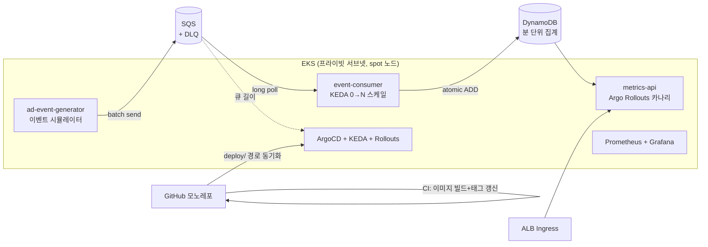

# adspectrum 설계 스펙

- 작성일: 2026-08-22
- 상태: 승인됨. 구현 중 변경된 사항은 `docs/DECISIONS.md`에 근거와 함께 기록한다.
- 이 문서는 다른 세션/작업자가 컨텍스트 없이 읽고 구현을 시작할 수 있도록 작성한 자기완결적 스펙이다.

## 1. 배경과 목적

매드업 DevOps Engineer(경력 1~5년) 채용 지원용 포트폴리오 프로젝트다. 공고 마감이 2026-08-29경이므로 **약 7일 안에 완성**해야 한다.

목적은 두 가지를 하나의 프로젝트로 증명하는 것이다.

1. **기술 매칭**: 공고의 기술 스택(EKS, Terraform, GitHub Actions, ArgoCD, Argo Rollouts, Helm, KEDA, Prometheus/Grafana)을 실제로 구축·운영할 수 있다.
2. **도메인 관심**: 매드업의 핵심 제품 Prism(광고 성과 데이터를 실시간 수집·적재하는 DMP)이 하는 일을 축소판으로 직접 구현해, 회사가 풀고 있는 문제를 이해하고 있음을 보여준다.

프로젝트 이름 `adspectrum`은 프리즘(Prism)을 통과한 빛이 스펙트럼이 되듯, 파편화된 광고 이벤트 스트림을 분해·집계해 보이게 만든다는 의미다.

### 공고 매칭 맵 (README와 면접 답변의 근거 자료)

| 공고 요구/우대 | 프로젝트 요소 |
|---|---|
| 클라우드 인프라(AWS, K8s)를 코드로 설계·운영 | Terraform 모듈로 VPC/EKS/SQS/DynamoDB/ECR/IAM 전부 관리 |
| GitOps·CI/CD 기반 배포 파이프라인 | GitHub Actions(CI) + ArgoCD app-of-apps(CD), 모노레포 GitOps |
| 모니터링·옵저버빌리티, 장애 대응 | kube-prometheus-stack, Grafana 대시보드, DLQ, 에러율 기반 자동 롤백 |
| 비용 최적화 | spot 노드, KEDA scale-to-zero, 온디맨드 DynamoDB, destroy/재적용 멱등성, Budget 알람 |
| 보안·접근 관리 | IRSA 파드별 최소 권한, GitHub OIDC(장기 시크릿 없는 CI 인증), 프라이빗 서브넷 |
| EDA(이벤트 드리븐), 대규모 트래픽/데이터 파이프라인 우대 | SQS 기반 이벤트 파이프라인 + KEDA 큐 길이 오토스케일링 |
| Argo Rollout | metrics-api 카나리 배포 + Prometheus 분석 기반 자동 롤백 |
| AI Native 개발 문화 (Claude Code) | 전 과정을 Claude Code로 개발, 레포 CLAUDE.md와 README에 활용 방식 기록 |

## 2. 성공 기준 (완료 정의)

아래 5개가 모두 재현 가능하면 완성이다.

1. `terraform apply` → `terraform destroy` → 재 `apply`가 수동 개입 없이 동작한다 (멱등성).
2. `apps/` 코드를 push하면 CI가 이미지를 빌드해 ECR에 푸시하고 `deploy/`의 이미지 태그를 갱신하며, ArgoCD가 이를 자동 동기화해 배포가 완료된다 (e2e GitOps).
3. 이벤트 발행량을 올리면 KEDA가 consumer를 0→N으로 스케일 아웃하고, 큐가 비면 다시 0으로 줄어드는 것이 그래프로 관측된다.
4. metrics-api에 결함이 주입된 버전을 배포하면 카나리 단계에서 에러율 분석에 걸려 자동 롤백된다.
5. README에 아키텍처 다이어그램, 위 3·4의 캡처, 설계 의사결정 기록이 정리되어 있다.

## 3. 아키텍처



### 데이터 흐름

1. generator가 광고 이벤트(노출/클릭/전환)를 초당 N건 SQS에 배치 발행한다. N은 환경변수로 조절한다.
2. consumer가 SQS를 long-poll(배치 10건)로 소비하고, 배치 내에서 캠페인·분 단위로 집계한 뒤 DynamoDB에 원자적 카운터(`ADD`)로 반영한다.
3. metrics-api가 캠페인별 기간 성과(노출/클릭/전환/비용, CTR·CVR·CPC는 조회 시 계산)를 반환한다.
4. KEDA가 SQS 큐 길이를 폴링해 consumer 레플리카를 0~10 사이에서 조절한다.

### 이벤트 스키마

```json
{
  "event_id": "uuid4",
  "campaign_id": "cmp-001",
  "ad_id": "ad-042",
  "channel": "naver | kakao | google | meta",
  "event_type": "impression | click | conversion",
  "cost_micro": 12000,
  "occurred_at": "2026-08-25T09:30:12+09:00"
}
```

- generator는 가중 랜덤으로 생성한다: impression ≫ click ≫ conversion (대략 1000 : 30 : 1). campaign 10개, ad 50개, 채널 4개를 고정 시드로 사용한다.
- `cost_micro`는 마이크로 단위 통화(1원 = 1,000,000)로, 부동소수 오차를 피한다.

### DynamoDB 집계 모델

| 항목 | 값 |
|---|---|
| 테이블 | `adspectrum-metrics` (온디맨드) |
| PK | `CAMP#<campaign_id>` |
| SK | `TS#<yyyy-MM-ddTHH:mm>` (분 버킷, KST) |
| 속성 | `impressions`, `clicks`, `conversions`, `cost_micro` — 전부 `UpdateItem ADD` |

**의사결정**: SQS는 at-least-once이므로 재전달 시 집계가 중복될 수 있다. MVP에서는 소량의 중복 오차를 허용하고 이 결정을 README에 명시한다. event_id 기반 dedup(조건부 쓰기)은 확장 로드맵으로 남긴다. 근거: 1주 범위에서 파이프라인 전체 완성이 개별 정합성보다 우선이며, 광고 집계 도메인에서 흔한 트레이드오프라 논의 자체가 어필 포인트다.

## 4. 레포 구조 (모노레포 GitOps)

```
adspectrum/
├── apps/
│   ├── ad-event-generator/      # Python, SQS 발행
│   ├── event-consumer/          # Python, SQS→DynamoDB 집계
│   └── metrics-api/             # FastAPI 조회 API
├── charts/                      # 앱별 Helm 차트 (metrics-api는 Rollout 리소스)
│   ├── ad-event-generator/
│   ├── event-consumer/
│   └── metrics-api/
├── deploy/                      # ★ ArgoCD가 바라보는 경로
│   ├── bootstrap/               # ArgoCD 설치 스크립트 + root Application
│   ├── apps/                    # app-of-apps 자식 Application 정의
│   └── values/                  # 환경 values (CI가 이미지 태그를 여기에 갱신)
├── infra/
│   ├── modules/                 # network / eks / data / iam
│   └── envs/dev/                # 루트 모듈 (단일 환경)
├── .github/workflows/           # CI
├── loadtest/                    # k6 스크립트
└── docs/
    └── specs/                   # 이 문서
```

**의사결정 — 모노레포**: GitOps 정석은 앱 레포와 배포 레포 분리지만, 1인 포트폴리오에서는 리뷰어가 링크 하나로 전체를 파악하는 가치가 더 크다. 분리 원칙은 `deploy/` 경로 격리로 표현하고, CI 루프는 아래 두 장치로 방지한다 (README에 트레이드오프 기록).

- CI 트리거에 `paths: [apps/**, charts/**]` 필터를 걸어 `deploy/` 변경으로는 빌드가 돌지 않게 한다.
- CI의 태그 갱신 커밋 메시지에 `[skip ci]`를 붙인다.

## 5. 애플리케이션 스펙

공통: Python 3.12, uv(패키지 관리), ruff(린트), pytest(테스트), 멀티스테이지 Dockerfile, non-root 실행, `prometheus_client`로 `/metrics` 노출(PodMonitor로 수집). 구조화 JSON 로깅(stdout).

### ad-event-generator (Deployment, replicas 1)

- 환경변수: `QUEUE_URL`, `EVENTS_PER_SEC`(기본 5), `AWS_REGION`
- 스키마 규칙에 따라 이벤트를 생성해 `SendMessageBatch`(10건)로 발행한다.
- 부하 시나리오는 `deploy/values/`에서 `EVENTS_PER_SEC`를 300으로 올리는 커밋으로 수행한다 (GitOps 방식의 부하 주입 — 데모 스토리에 포함).
- 메트릭: `adspectrum_events_published_total{event_type=...}`

### event-consumer (Deployment, KEDA 대상)

- 환경변수: `QUEUE_URL`, `TABLE_NAME`, `BATCH_SIZE`(기본 10), `AWS_REGION`
- long-poll(20초) → 배치 내 (campaign, 분) 단위 사전 집계 → DynamoDB `UpdateItem ADD` → 성공한 메시지만 삭제.
- 처리 실패 메시지는 삭제하지 않는다 → SQS 재전달 → `maxReceiveCount=3` 초과 시 DLQ로 이동한다. 빈 catch 없이, 실패는 로깅 후 재전달에 맡긴다.
- graceful shutdown: SIGTERM 수신 시 처리 중 배치를 마치고 종료한다 (KEDA scale-in 대비).
- 메트릭: `adspectrum_events_consumed_total`, `adspectrum_batch_flush_seconds`

### metrics-api (Rollout, 카나리 대상)

- FastAPI. 엔드포인트:
  - `GET /campaigns/{campaign_id}/metrics?from=&to=` — 분 버킷 Query 후 합산, CTR/CVR/CPC 계산해 반환
  - `GET /healthz` — liveness/readiness
  - `GET /metrics` — Prometheus (p95 레이턴시, 요청 수, 5xx 카운트)
- 환경변수: `TABLE_NAME`, `AWS_REGION`, `FAULT_RATE`(기본 0)
- `FAULT_RATE=0.5`로 배포하면 응답의 절반이 500을 반환한다 — **카나리 자동 롤백 데모 전용 장치**이며 README에 용도를 명시한다.

## 6. 인프라 스펙 (Terraform)

- 리전: `ap-northeast-2`(서울). 단일 환경(`envs/dev`).
- 상태 파일: 로컬 state + `.gitignore` 처리. **의사결정**: 1인 단기 프로젝트라 S3 백엔드의 부트스트랩 비용을 생략한다. 팀 전제라면 S3 + lockfile이 정석임을 README에 기록. (스테이트 파일과 `.terraform/`은 절대 커밋하지 않는다.)
- 모듈 구성:

| 모듈 | 내용 |
|---|---|
| `network` | VPC, 퍼블릭/프라이빗 서브넷 2AZ, **단일 NAT GW**(비용 절감, 결정 기록) |
| `eks` | EKS(작성 시점 최신 안정 버전), 관리형 노드그룹 **spot t3.medium, desired 2 / max 4**, 애드온(vpc-cni, coredns, kube-proxy), OIDC 프로바이더. vpc-cni는 **prefix delegation 활성화** (DECISIONS 001) |
| `data` | SQS 메인 큐 + DLQ(`maxReceiveCount=3`), DynamoDB 온디맨드 테이블, ECR 리포 3개(스캔 활성화) |
| `iam` | IRSA 역할 4종 + GitHub Actions OIDC 역할 |

- IRSA 최소 권한 매핑:

| ServiceAccount | 권한 |
|---|---|
| ad-event-generator | `sqs:SendMessage` (메인 큐 한정) |
| event-consumer | `sqs:ReceiveMessage/DeleteMessage/GetQueueAttributes` + `dynamodb:UpdateItem` |
| metrics-api | `dynamodb:Query` |
| keda-operator | `sqs:GetQueueAttributes` |
| grafana | CloudWatch 읽기 (큐 깊이 패널용) |

- GitHub Actions용 IAM 역할은 **OIDC 신뢰 정책**(리포 조건 포함)으로 만들고 ECR push 권한만 부여한다. 장기 액세스 키를 만들지 않는다.
- AWS Budgets: 월 8만 원 초과 시 이메일 알람.

## 7. 배포 체계 (CD)

### 부트스트랩 (1회 수동)

`terraform apply` → `aws eks update-kubeconfig` → `deploy/bootstrap/install.sh`:

1. Helm으로 ArgoCD 설치 (UI는 port-forward로 접근, 외부 노출 없음 — 비용·보안 결정 기록)
2. root Application(`deploy/bootstrap/root-app.yaml`) 적용

이후 클러스터 내부의 모든 변경은 Git을 통해서만 이루어진다.

### app-of-apps 구성 (`deploy/apps/`)

root가 다음 자식 Application들을 관리한다: `aws-load-balancer-controller`, `keda`, `argo-rollouts`, `kube-prometheus-stack`(Grafana 포함), 앱 3종(`charts/` + `deploy/values/` 참조). 전부 automated sync + prune + self-heal.

### 카나리 (metrics-api)

- Argo Rollouts `Rollout` + ALB 가중치 트래픽 분할: 20% → (분석 1분) → 50% → (분석 1분) → 100%
- `AnalysisTemplate`: Prometheus에서 metrics-api 5xx 비율을 질의해 **5% 초과 시 실패, failureLimit 1 → 자동 롤백**
- 데모 시나리오: `FAULT_RATE=0.5` 태그를 배포 → 카나리 20% 단계에서 분석 실패 → 자동 롤백되는 과정을 `kubectl argo rollouts get rollout --watch`로 캡처

## 8. CI (GitHub Actions)

워크플로 `ci.yaml` (트리거: `push` to `main`, `paths: [apps/**, charts/**]`):

1. 변경된 앱 감지 (paths-filter) → 앱별 매트릭스
2. `ruff check` + `pytest`
3. Docker 빌드, 태그 = git SHA(short)
4. OIDC로 IAM 역할 assume → ECR push
5. `yq`로 `deploy/values/<app>.yaml`의 이미지 태그 갱신 → `[skip ci]` 커밋 push

PR 워크플로는 lint+test만 수행한다.

## 9. 오토스케일링과 관측

### KEDA

- `ScaledObject`(event-consumer): SQS 큐 길이 트리거, `queueLength: 100`, `minReplicaCount: 0`, `maxReplicaCount: 5`, `cooldownPeriod: 120` (상한 근거는 DECISIONS 001)
- 인증은 keda-operator IRSA 사용 (`identityOwner: operator`)

### 대시보드 (Grafana, 최소 5패널)

1. 초당 발행/소비 이벤트 수 (rate)
2. SQS 큐 깊이 (CloudWatch 데이터소스)
3. consumer 레플리카 수 — 큐 깊이와 겹쳐 그려 KEDA 동작을 한 장으로 보여주는 **핵심 캡처**
4. metrics-api p95 레이턴시 / 5xx 비율
5. DLQ 메시지 수 (0이 정상임을 보여주는 패널)

### 부하 테스트

- 파이프라인 부하: generator `EVENTS_PER_SEC` 5 → 300 커밋 (GitOps 부하 주입)
- API 부하: `loadtest/k6-api.js`로 metrics-api에 RPS 부하 (카나리 중 트래픽 공급 겸용)

## 10. 7일 일정 (완료 기준 포함)

| 일차 | 작업 | 완료 기준 |
|---|---|---|
| 1 | Terraform 모듈 + envs/dev 작성, apply | EKS 노드 Ready, SQS/DynamoDB/ECR 생성 확인 |
| 2 | ArgoCD 부트스트랩, ALB controller·KEDA·Rollouts·prometheus-stack Application 등록 | ArgoCD UI에서 전 앱 Synced/Healthy |
| 3 | 앱 3종 구현 + 단위 테스트 + Dockerfile + Helm 차트 | 로컬 테스트 통과, 수동 배포로 e2e 데이터 흐름 확인 |
| 4 | CI 파이프라인 + 태그 갱신 자동화 | push → 자동 배포 e2e 성공 (성공 기준 2) |
| 5 | KEDA ScaledObject + 부하 주입 | 0→N→0 스케일 그래프 확보 (성공 기준 3) |
| 6 | 카나리 + AnalysisTemplate + 결함 주입 롤백 데모, 대시보드 마무리 | 자동 롤백 캡처 확보 (성공 기준 4) |
| 7 | README(다이어그램·캡처·의사결정), destroy/재apply 검증, 버퍼 | 성공 기준 1·5 충족 |

### 시간 부족 시 컷라인 (위에서부터 먼저 줄인다)

1. Grafana 대시보드 고도화 → 기본 패널 3개로 축소
2. 카나리 자동 분석 → 수동 promote 데모로 축소 (Rollouts 자체는 유지)
3. generator 상시 Deployment → 일회성 Job으로 축소

**절대 컷 불가**: Terraform 멱등성, e2e GitOps 흐름, KEDA 스케일링. 이 셋이 프로젝트의 뼈대다.

## 11. 비용 계획

| 항목 | 예상(상시 가동 기준) |
|---|---|
| EKS 컨트롤플레인 | ~$73/월 |
| spot t3.medium ×2 | ~$18/월 |
| NAT GW 단일 | ~$35/월 + 트래픽 |
| ALB | ~$20/월 |
| SQS/DynamoDB/ECR | 수 $ 이내 (온디맨드, 저볼륨) |

상시 가동 시 월 10만 원을 넘길 수 있으므로 **작업하지 않는 날은 destroy**한다 (멱등성이 성공 기준 1인 이유). 실제 작업일 기준 예상 지출은 3~5만 원. Budget 알람 8만 원.

## 12. 범위 제외 (Non-goals) 와 확장 로드맵

다음은 의도적으로 제외하며, README의 "확장 로드맵" 섹션에 이유와 함께 기록한다.

- HashiCorp Vault / Boundary (공고 스택이지만 1주 범위 초과 — 로드맵에서 External Secrets + Vault 구상 언급)
- Tempo 분산 트레이싱, Datadog/Sentry
- Kafka/Kinesis (SQS 선택 근거: 관리 부담 최소화 + KEDA 연동 단순성. 수조 단위 스케일에서는 Kinesis/Kafka가 적합함을 로드맵에 언급)
- event_id 기반 exactly-once 집계 (3장 의사결정 참조)
- 멀티 환경(stage/prod), Karpenter, Route 53 커스텀 도메인
- HTTPS(ACM) — ALB 기본 DNS + HTTP로 데모 (도메인 미보유 전제)

## 13. 리스크와 대응

| 리스크 | 대응 |
|---|---|
| EKS/ALB controller 초기 설정 삽질로 1~2일차 지연 | 공식 Terraform 모듈(terraform-aws-modules) 사용, 직접 모듈 작성은 network/data/iam만 |
| spot 중단으로 데모 중 노드 소실 | 노드그룹 max 4로 재조달 여유, 데모 캡처는 사전 확보 |
| CI 태그 커밋 루프 | paths 필터 + `[skip ci]` 이중 방어 (4장) |
| KEDA IRSA 인증 오류 (흔한 함정) | `identityOwner: operator` 방식 고정, 1일차에 권한 매핑 검증 |
| 일정 초과 | 10장 컷라인 순서대로 축소 |

## 14. 최종 산출물 체크리스트 (README에 수록)

- [ ] 아키텍처 다이어그램 (mermaid)
- [ ] 공고 매칭 맵 (1장 표 재사용, 문구는 회사명 없이 일반화 여부를 지원 전 판단)
- [ ] ArgoCD 앱 트리 Synced/Healthy 스크린샷
- [ ] KEDA 스케일링 그래프 (큐 깊이 + 레플리카 수 겹친 패널)
- [ ] 카나리 자동 롤백 진행 화면 캡처
- [ ] CI 성공 런 링크
- [ ] 설계 의사결정 기록 (모노레포, SQS, 중복 허용, 단일 NAT, 로컬 state, 비용 통제)
- [ ] 확장 로드맵
- [ ] AI Native 워크플로 섹션 (Claude Code 활용 방식: 레포 CLAUDE.md, 스펙 기반 구현 흐름)
- [ ] 실행 방법 (`terraform apply`부터 데모 재현까지 명령 순서)
